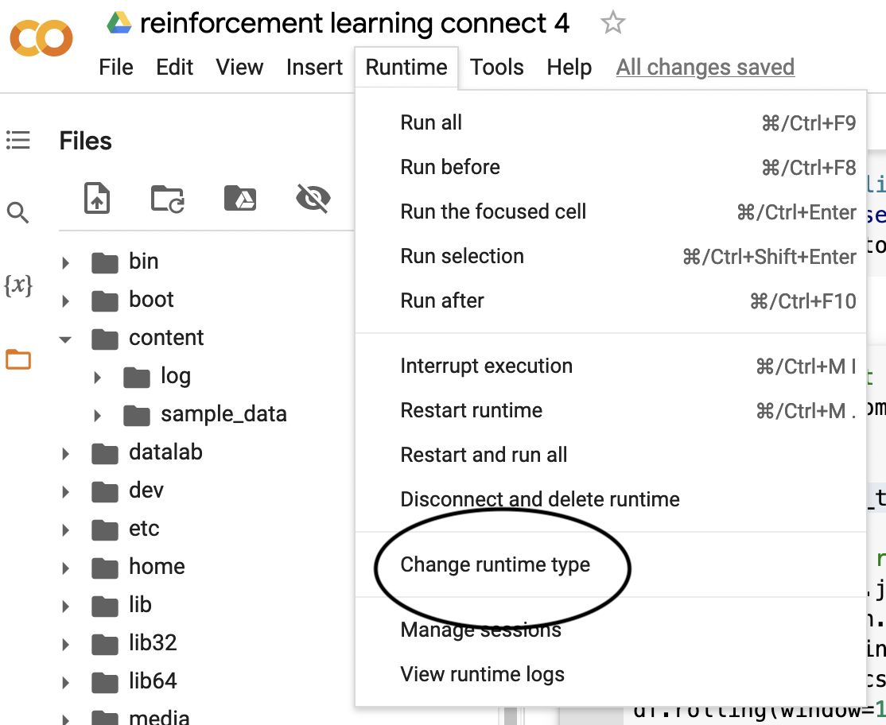
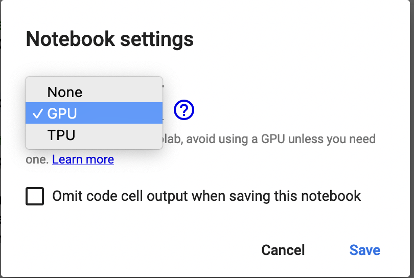
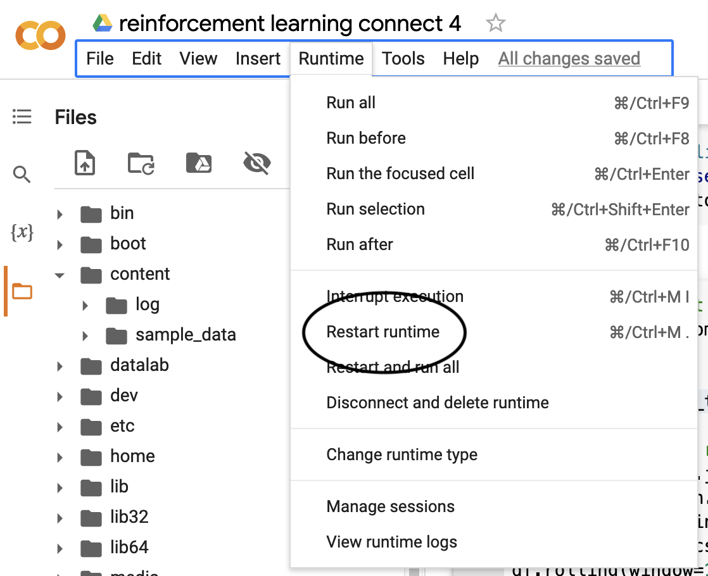

# Reinforcement Learning self-play

## Kaggle Learn course

Most of the connect four code is from this [Kaggle Learn course, Intro to Game AI and Reinforcement Learning](https://www.kaggle.com/learn/intro-to-game-ai-and-reinforcement-learning)

Running this code requires a GPU in practice. Training the agent (`model.learn(total_timesteps=80000)`) takes 15m with a GPU. Using a CPU would take 100-1000x times longer.

### How to turn on a GPU in Google Colab

I didn't have any luck running that code in a Kaggle notebook. I had problems with dependencies and very slow running time.

I switched to Google Colab and turned on a GPU.

### Managing libraries in jupyter

In general, after installing libraries a user needs to restart a jupyter notebook. You can save time by running all of that code in a block at the top, then restarting.

To make the dependencies easier to manage, I put the `!pip install` and `!apt-get` code in the top code block. When you load this notebook for the first time, run these blocks, then restart your runtime.

After restarting the runtime, all of the libraries should be available to load.
